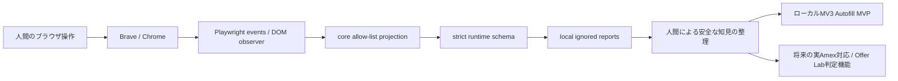

# Architecture

## 全体とデータフロー

単一npmプロジェクト。monorepo管理ツールやビルドframeworkは導入しない。

## application-probe

- CLI: 初期URLの安全なhostチェック、headed browser起動、inspect/diagnose/idle/finish、出力権限と終了処理。
- `browser-script`: documentごとのtrusted focus/input/change/blurの観測。フォームの値を取得しない。操作するAPIは提供しない。
- `Recorder`: contextレベルのrequest/response/finished/failedイベント、frame/document内の一時IDを実行内field aliasへ変換する。
- `report`: 保存直前のstrict schema検証、stepごとのMarkdown。自由なエラー文字列を保存しない。

操作は `performance.timeOrigin + performance.now()`、通信はPlaywright Request.timingのstartTimeを使う。終了時に開始時刻を補正し、export時に時刻順で再対応付けする。これによりbinding配送の遅延やレスポンスの遅延に依存しない。開始時刻が得られない通信は受信時刻を使うため精度が下がる。

statusは受信時、duration/responseMsは取得できた場合のみ設定する。未完了はpending、失敗はfailed、redirectは別requestとredirectedFrom sequence。HTTP 4xx/5xxも通信自体が完了すればfinished。

### 観測の限界

- stepは直前の観測操作との時間的関連。背景通信、debounce、並行frame、navigationの後処理を因果的に分離できない。
- initiator stackは取得しない（script URLや引数に秘密があり得る）。`initiator: not-collected` と `attribution: temporal-only` を必ず保持。
- 実probeはsite本来の挙動をなるべく保つためservice workersをallowした新規context（Observation: allowed）。offline browser smokeはblock（Observation: blocked）。通常の既存sessionや通常ウィンドウと同条件ではない。incognitoの判定も行わない。
- HTTP request lifecycleが対象。Service Worker allowは完全取得を意味しない。一部SW挙動の可視性は未検証。WebSocket frame、WebRTC、browser内部通信は記録しない。閉じる瞬間の非同期イベントは取りこぼす可能性がある。
- native input/select/textareaを対象とする。custom combobox、closed shadow DOM、クロスプロセスframe等の完全性は未検証。DOM inspectionはdocument querySelectorベースでshadow treeを走査しない。
- DOM検査中に破棄されたframeはスキップする。次のinspectで再試行する。CLIのinspection診断で、今回の取得状態・固定の失敗分類・件数を累積fieldsと分けて表示する。raw例外は表示しない。
- raw DOM属性の候補は一時的にメモリでのみ識別に使う。exact allow-list以外はログへ残らないため、selectorの採否は実機で別途確認が必要。
- ブラウザのフォーム送信を技術的に完全遮断するものではない。人間も調査中はSubmit/Acceptしない。

Playwright公式: [Request lifecycle/timing](https://playwright.dev/docs/api/class-request)、[Service workers](https://playwright.dev/docs/service-workers)。

## core

- `amex/fields`: ユーザー指定の候補ラベル語彙。name/id/autocomplete/aria-label/label/placeholderを比較し、競合はambiguous。Amex固有selectorの確認済みデータではない。
- `amex/url`: HTTPS exact hostで単一applicationCode queryを優先し、queryがない場合だけpathname末尾を構文解析。重複・不正queryは拒否する。ユーザー観測のBusiness Platinum URL例をサポートするが、書式がAmex公式仕様とは主張しない。
- `redaction`: 任意objectを保存する汎用redactではなく、既知のプロパティだけから新規objectを構築。unknown host/pathのaliasは実行間比較には使えない。将来、実機確認済みの固定routeだけをcode reviewで許可する。
- `schemas`: nested strict schema。PIIや自由文結果、raw URL、未定義フィールドを拒否。schemaエラーもraw出力しない。

## Chrome Extension（Phase 2B・ローカル限定）

MV3、Vanilla TypeScript、esbuildでdistへビルド。popupで7項目を編集・storage.localへ保存し、明示的な検出とFill Nowを実行する。
main frame / ISOLATED worldで自己完結した入力関数を実行。検出時のdocument IDとtab IDを保持し、入力時の再検証も行う。
manifestはloopbackだけにhost権限を付け、入力関数もport/path/query/hashを確認する。background workerはstorageアクセスをTRUSTED_CONTEXTSへ制限する。
profileのstrict schemaと研究Observationは独立し、値を診断結果へ返さない。永続保存・編集・全削除はユーザーの明示依頼に基づく。
詳細・ガード・限界は[extension README](../apps/extension/README.md)を正本とする。

probeのdiagnoseは最小式からobserver件数までの独立評価。固定enum/boolean/件数のみのstrict schemaで出力し、URL・例外本文・フォーム値は含めない。診断はCLI表示だけでreportへ保存しない。

## 将来拡張の順序

ローカルFill Now MVPは実装済み。実Amex適合性の検証、未解決のmain frame DOM取得問題、条件注釈・Offer Lab比較UIは今後の作業。body解析が必要になっても、まず構造のみをメモリで検査し、安全性を明示判断したendpoint/field単位のadapterを追加する。未知bodyを再帰保存する機能は作らない。
