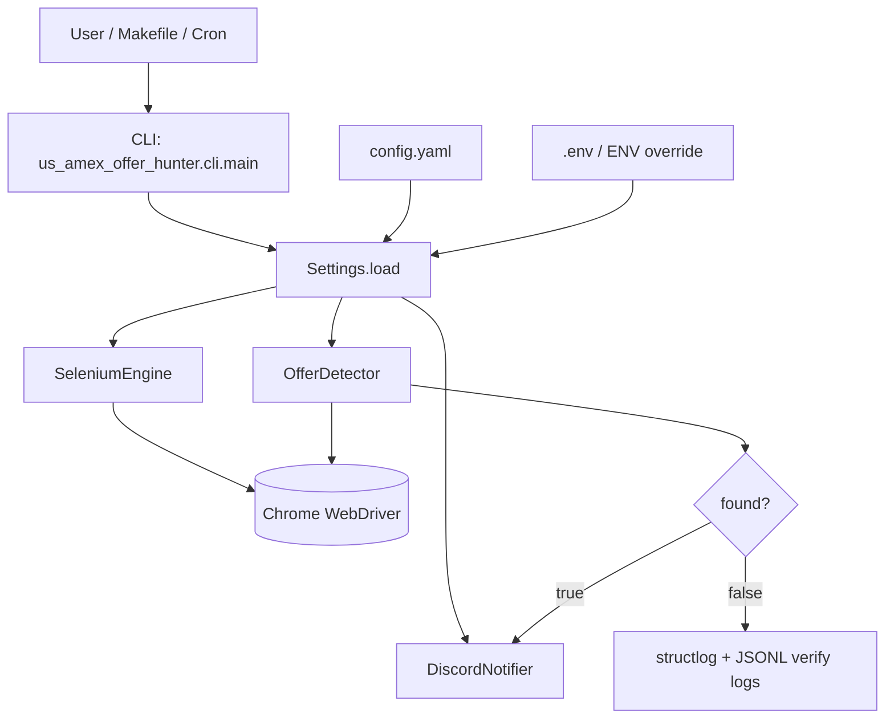

## Amex Offer Hunter システム設計書

このドキュメントは、現時点の実装を基準に「どこで何をしているか」を整理した設計書です。

---

## 1. 目的と設計方針

- **目的**: Amex referral ページから対象オファー金額（例: 200,000 / 300,000）を安定抽出し、ヒット時に通知する。
- **方針**:
  - 設定は `config.yaml` を真実のソースにし、秘匿値のみ `.env` / 環境変数で上書き。
  - Selenium 側のページ差分（headless / 動的描画 / モーダル）を前提に、抽出はリトライ型で実装。
  - 抽出不能時は `amount=None` を返し、誤検出（無関係な数値）を避ける。

---

## 2. 全体アーキテクチャ

---

## 3. 設定設計 (`src/core/settings.py`)

### 3.1 モデル

- `ProxySettings`
- `DiscordSettings`
- `TelegramSettings`（将来拡張）
- `SeleniumSettings`
  - `headless: bool`
  - `disable_automation_flags: bool`
  - `user_agent: Optional[str]`
- `AppConfig`
  - `proxies`, `discord`, `telegram`, `selenium`, `urls`, `targets`

### 3.2 ロード戦略

1. `config.yaml` 読み込み
2. `US_AMEX_OFFER_HUNTER_CONFIG__...` プレフィックスの `.env` / 環境変数で deep-merge 上書き
3. `pydantic` で型バリデーション

---

## 4. Selenium / 抽出設計 (`src/us_amex_offer_hunter/core/engine.py`)

### 4.1 `SeleniumEngine`

- ChromeOptions を `SeleniumSettings` から構成
  - `headless` の切替
  - `disable_automation_flags` が有効なら軽量 stealth オプションを適用
  - `user_agent` が指定されていれば上書き
- WebDriver 生成と `quit()` のライフサイクルを管理

### 4.2 `OfferDetector` の判定フロー

1. `driver.get(url)`
2. referral モーダルを best-effort で dismiss（`Continue` クリックを複数手段で試行）
3. 描画待機（`_wait_for_offer_render`）
4. **優先抽出**: `_extract_amount_with_retries`
   - dialog配下を除外した `h1-h4` テキストを優先（B方針）
   - 取れなければ `body.text` も利用
   - 短時間ポーリングして遅延描画に追従
5. さらに取れなければ `__INITIAL_STATE__` を strict モードで解析
6. `OfferResult(url, found, amount, raw_text)` を返却

### 4.3 抽出ロジック

- `earn <number> ... points` を最優先
- `points back` は除外
- strictモードでは「雑な数値fallback」を使わず、誤検出を抑制

---

## 5. CLI / 実行モード (`src/us_amex_offer_hunter/cli/main.py`)

- 通常実行: `run_once()`
- テスト通知: `--notify-test`
- 検証実行（非通知）:
  - `--verify-once`
  - `--verify-loop --iterations N --interval-sec S [--stop-on-hit]`
  - `--verify-summary`
  - `--verify-ab --profiles "profileA,profileB"`
- デバッグダンプ:
  - `--dump-elements`
  - `--dump-page-source`
  - `--dump-body-text`
  - `--dump-dir`

出力先:

- `runs/verify_amounts.jsonl`
- `runs/verify_elements.jsonl`
- `runs/debug/iterXXX.*`

検証ログ (`runs/verify_amounts.jsonl`) は以下を持つ:

- `timestamp`, `iteration`, `url`, `found`, `amount`
- `headless`, `user_agent`, `profile_name`, `condition_label`
- `runtime.os`, `runtime.python_version`, `runtime.browser_version`

`--stop-on-hit` 指定時は `found=true` を検知した時点で verify-loop を即時終了する。  
`--notify-on-hit` を併用すると、fresh browser セッションで `double_check` して再度ヒットした場合のみ通知する。

---

## 6. テスト方針

- `tests/test_settings.py`: 設定ロードと上書き
- `tests/test_selenium.py`: 抽出ロジック（DummyDriver）
- `tests/test_notifier_discord.py`: 通知インターフェース
- `tests/test_main.py`: CLIディスパッチ

品質ゲート:

- `ruff format`
- `ruff check`
- `mypy --strict`
- `pytest`

---

## 7. 現在の既知制約

- 実機では `headless=false` の方が安定して同じDOMを得られる傾向がある
- Cursor実行環境では Chrome GUI セッション起動に失敗する場合がある
- referral ページは動的描画とモーダルが強く、タイミング依存の再発リスクがあるため、verifyログで継続監視が必要

