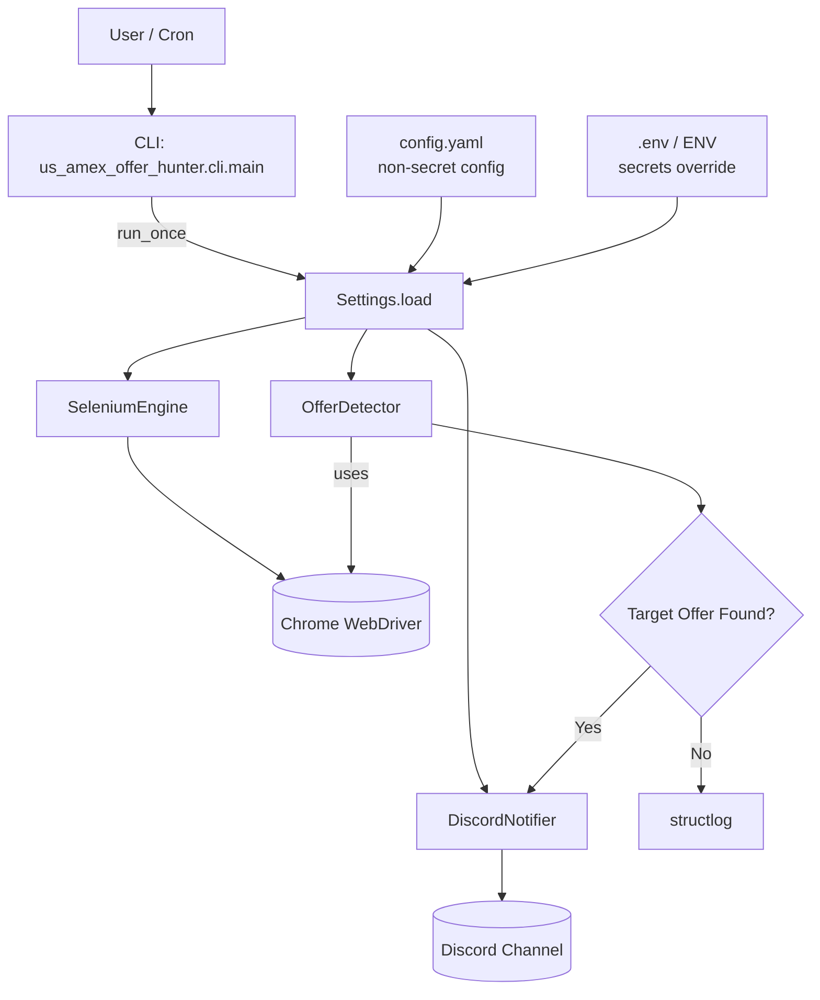

## Amex Offer Hunter システム設計書

本ドキュメントは、`docs/ROADMAP.md` が示す開発ステップとは別に、システム全体の **アーキテクチャ / 役割分担 / 設計方針** をまとめたものです。

---

## 1. 全体アーキテクチャ概要

- **目的**: Amex Business Platinum などの高額オファー（例: 300k / 250k ポイント）を自動検知し、「どの条件で当たりやすいか」を統計的に分析する。
- **構成要素（MVP 時点）**:
  - `core.settings.Settings`: 設定管理（`config.yaml` + `.env` / 環境変数）
  - `us_amex_offer_hunter.core.SeleniumEngine`: Selenium WebDriver ラッパー
  - `us_amex_offer_hunter.core.OfferDetector`: ページ内容からオファー金額を抽出するドメインロジック
  - `us_amex_offer_hunter.notifier.DiscordNotifier`: Discord 通知
  - `us_amex_offer_hunter.cli.main`: CLI エントリポイント（`run_once`, `notify_test`）

処理の主な流れ（`run_once`）:

1. `Settings.load()` で設定をロード。
2. `SeleniumEngine` を生成し、ヘッドレス Chrome を起動。
3. `OfferDetector` で `config.urls` を順番にチェック。
4. ターゲット金額 (`config.targets`) にマッチしたら `DiscordNotifier` で通知。
5. 処理終了時に WebDriver をクリーンアップ。

### 1.1 アーキテクチャ図（MVP）

---

## 2. 設定管理 (`core.settings`)

- **役割**: アプリケーション全体の設定を 1 箇所で表現し、型付きで扱う。
- **技術スタック**:
  - `pydantic` による設定モデル（型付き）
  - `PyYAML` による `config.yaml` ロード
  - `.env` / 環境変数による上書き（秘匿値）

### 2.1 モデル構造

- `ProxySettings`: プロキシ関連（provider, api_key, country）
- `DiscordSettings`: Discord Bot 設定（bot_token, channel_id）
- `TelegramSettings`: 将来の Telegram 用設定（bot_token, chat_id）
- `AppConfig`: 上記 + `urls`・`targets` を束ねたアプリ全体設定
- `Settings`:
  - フィールド:
    - `config: AppConfig` … 実際の設定オブジェクト
  - `model_config`:
    - `env_prefix="US_AMEX_OFFER_HUNTER_"`
    - `env_nested_delimiter="__"`
    - `env_file=".env"`

### 2.2 ロード順序

1. `config.yaml` を読み込み、`AppConfig` としてバリデーションする。
2. `.env` / プロセス環境変数（`US_AMEX_OFFER_HUNTER_CONFIG__...`）で上書きを適用する（秘匿値が主用途）。

---

## 3. Selenium レイヤ (`us_amex_offer_hunter.core.engine`)

### 3.1 `SeleniumEngine`

- **役割**: Selenium WebDriver の生成・ライフサイクル管理。
- **主な挙動**:
  - Headless Chrome オプション設定（`--headless=new`, `--disable-gpu`, `--no-sandbox` など）。
  - `Settings.config.proxies` を受け取り、将来の `ProxyManager` 統合ポイントとしてログ出力。
  - WebDriver 初期化失敗時は `WebDriverException` をログに記録して再送出。
  - `close()` で `quit()` を呼び出し、例外は warning ログにとどめる。

**今後の拡張ポイント（ロードマップ 2 の対象）**:

- タイムアウト（ページロード / 要素検出）
- リトライ回数
- User-Agent 切り替え（固定 / ランダム）
- プロキシ設定注入 (`ProxyManager` から `ChromeOptions` へ)

### 3.2 `OfferDetector`

- **役割**: 「URL を開いて、オファー金額がターゲットかどうか」を判定する高レベルロジック。
- **現在の実装概要**:
  - `driver.get(url)` でページを開く。
  - `find_elements(By.TAG_NAME, "body")` で body テキストを取得。
  - `_extract_amount(text)` でテキストから金額候補を抽出し、`targets` に含まれるか判定。
  - 結果を `OfferResult`（url, found, amount, raw_text）として返す。
  - Selenium 側の例外はログを残したうえで、「found=False / amount=None」という失敗結果として返す。

将来的には、実際の Amex DOM 構造にフィットしたセレクタ & パーサに置き換えていく。

---

## 4. 通知レイヤ (`us_amex_offer_hunter.notifier`)

### 4.1 `NotifierProtocol`（将来拡張用インターフェース）

- Discord / Telegram / Slack などの通知チャネルを差し替えやすくするための抽象化。
- 各実装は「オファーを通知する」「エラーを通知する」といったメソッドを実装する想定。

### 4.2 `DiscordNotifier`

- **役割**: Discord チャンネルへのメッセージ送信。
- **実装のポイント**:
  - `settings.config.discord` からトークン・チャンネルID を取得。
  - `notify_offer_found`, `notify_error` を提供。
  - 内部で `_send_with_retries` を使い、**最大3回まで自動リトライ**。
  - `discord.Client` の `on_ready` イベントで指定チャンネルにメッセージを送信し、即終了。

今後、エラー通知経路を統合し、「すべての例外が少なくとも Discord（将来は Telegram も）に流れる」ようにする。

---

## 5. CLI / エントリポイント (`us_amex_offer_hunter.cli.main`)

- `run_once()`:
  - Settings → SeleniumEngine → OfferDetector → DiscordNotifier を組み合わせて、1 回分のオファーチェックを実行。
- `notify_test()`:
  - 設定から DiscordNotifier を初期化し、テストメッセージを 1 通だけ送る。
- `app()`:
  - `console_scripts` から呼ばれるエントリ。現在は `run_once()` を実行。
- `python -m us_amex_offer_hunter.cli.main` 時:
  - `argparse` で `--notify-test` を受け取り、テスト通知か通常実行かを切り替える。

---

## 6. テスト戦略

- `tests/test_settings.py`:
  - `ProxySettings` / `DiscordSettings` / `AppConfig` / `Settings` のモデル構築が正しく行われるか確認。
- `tests/test_selenium.py`:
  - `DummyDriver` / `DummyEngine` を使って Selenium をモックし、`OfferDetector` のロジック単体をテスト。
- `tests/test_notifier_discord.py`:
  - DiscordNotifier のインターフェースとリトライロジックをテスト（ネットワーク呼び出しはモック前提）。
- `tests/test_main.py`:
  - `main.app()` が `run_once()` を呼ぶことを確認するライトなテスト。

カバレッジ目標は主要コンポーネントで **80%以上**（`mypy --strict` / `pytest-cov` を前提）。

---

## 7. 今後の設計拡張ポイント（ハイレベル）

ロードマップに対応するかたちで、設計面での主な拡張ポイントを整理する。

- `ProxyManager`:
  - プロキシ取得 / ヘルスチェック / ローテーション戦略を 1 箇所に集約。
  - Selenium 以外のクライアント（将来の HTTP 経由スクレイピングなど）でも使い回せる設計にする。
- `StatsEngine` / `ExperimentRunner`:
  - 「条件セット」を型で表現し、実験の構成をコードとデータの両方から理解できるようにする。
  - SQLite スキーマ設計と pandas ロジックを分離し、テストしやすくする。
- `Dash UI`:
  - API 層（データ提供）と UI 層（Dash コンポーネント）を分け、バックエンドの差し替えを容易に。

これらの詳細は、実装が進んだ段階で本設計書に追記していく。

